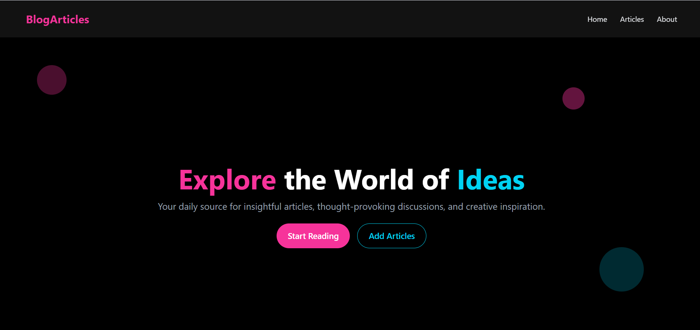
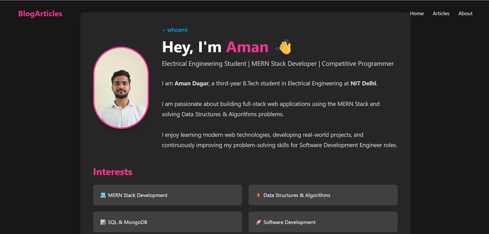

# 📝 BlogArticles

A modern **full-stack MERN Blog Platform** where users can create, publish, and explore articles with Markdown support, responsive UI, and MongoDB Atlas integration.


---

# 📖 About

BlogArticles is a full-stack blogging platform built using the **MERN Stack**. Users can create, publish, and explore articles with a clean, responsive interface. The platform supports Markdown rendering, cover images, author information, and MongoDB Atlas integration, providing a seamless writing and reading experience.

---

# ✨ Features

- 📰 Create and publish blog articles
- 📚 Read detailed articles
- ✍️ Markdown support
- 🖼️ Cover image support
- 👤 Author information
- 📅 Automatic publish date
- 👁️ View counter
- ❤️ Like counter
- 📱 Responsive design
- ☁️ MongoDB Atlas integration
- ⚡ Fast and lightweight interface

---

# 🛠 Tech Stack

### Frontend

- React.js
- React Router DOM
- Axios
- Tailwind CSS
- React Markdown

### Backend

- Node.js
- Express.js
- MongoDB
- Mongoose

### Deployment

- Vercel
- Render
- MongoDB Atlas

---

# 📂 Project Structure

```text
Blog-Articles
│
├── backend
│   ├── model
│   ├── routes
│   ├── server.js
│   ├── package.json
│   └── .env
│
├── frontend
│   ├── public
│   ├── src
│   │   ├── assets
│   │   ├── components
│   │   ├── pages
│   │   ├── App.jsx
│   │   └── main.jsx
│   │
│   ├── package.json
│   └── vite.config.js
│
├── README.md
└── .gitignore
```

---

# 🚀 Installation

## 1. Clone the Repository

```bash
git clone https://github.com/aman-dagar22/Blog-Articles.git
```

```bash
cd Blog-Articles
```

---

## 2. Backend Setup

```bash
cd backend
npm install
```

Create a `.env` file:

```env
PORT=3000
MONGO_URI=YOUR_MONGODB_CONNECTION_STRING
```

Run the backend:

```bash
npm start
```

---

## 3. Frontend Setup

```bash
cd frontend
npm install
npm run dev
```

---

# 📸 Screenshots

## Home Page

<p align="center">
  
</p>

---

## About Page

<p align="center">
  
</p>

---

# 🔮 Future Improvements

- 🔐 User Authentication
- 💬 Comments System
- 🏷️ Categories & Tags
- 🔍 Search Functionality
- 🌙 Dark / Light Theme
- 📊 Admin Dashboard
- 🔖 Bookmark Articles
- 📤 Social Sharing
- 📑 Related Articles
- 📄 Pagination

---

# 👨‍💻 Author

**Aman Dagar**

B.Tech Electrical Engineering

National Institute of Technology Delhi

GitHub: **https://github.com/aman-dagar22**

---

# ⭐ Support

If you found this project helpful, consider giving it a ⭐ on GitHub.

---

# 📄 License

This project is licensed under the **MIT License**.
